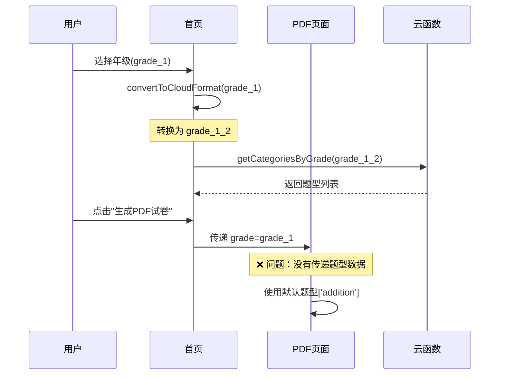

# 🐛 首页年级选择后无法带出题型问题诊断与修复

## 📋 问题描述

**症状**：用户在首页选择年级和题目数量后，点击"生成PDF试卷"跳转到PDF生成页面时，题型选择未能正确带入，导致用户需要重新选择。

**影响范围**：首页 → PDF生成页面的数据传递

---

## 🔍 问题根因分析

### 1. 数据流程梳理



### 2. 核心问题定位

#### 问题1: **年级格式不一致** ⚠️

**首页 (home/index.js)**:
```javascript
// 首页使用新格式 grade_1 ~ grade_6
gradeOptions: [
  { value: 'grade_1', name: '一年级' },
  { value: 'grade_2', name: '二年级' },
  ...
]

// 但在调用云函数时转换为旧格式
convertToCloudFormat(gradeKey) {
  const cloudMapping = {
    'grade_1': 'grade_1_2',  // ❌ 转换为旧格式
    'grade_2': 'grade_1_2',
    ...
  };
}
```

**PDF页面 (pdfGenerator/index.js)**:
```javascript
// PDF页面也使用新格式
gradeOptions: [
  { value: 'grade_1', label: '一年级' },
  ...
]

// ❌ 问题：直接使用 grade_1 调用云函数，没有转换
onLoad(options) {
  if (options.grade) {
    this.setData({ selectedGrade: options.grade }); // grade_1
  }
}
```

**云函数 (gradeEngine)**:
```javascript
// 云函数已升级为新格式 grade_1 ~ grade_6
GRADE_CONFIG = {
  'grade_1': { ... },  // ✅ 新格式
  'grade_2': { ... },
  ...
}
```

**结论**: 首页使用旧格式调用云函数（grade_1_2），但云函数已升级为新格式（grade_1），导致找不到配置！

---

#### 问题2: **题型数据未传递** ❌

**首页跳转代码**:
```javascript:381:385
// pages/home/index.js
goToPdfGenerator() {
  wx.navigateTo({
    url: `/pages/pdfGenerator/index?grade=${this.data.selectedGrade}&count=${this.data.selectedCount}`
    // ❌ 只传递了 grade 和 count，没有传递题型数据
  });
}
```

**PDF页面接收代码**:
```javascript:71:77
// pages/pdfGenerator/index.js
onLoad(options) {
  if (options.grade) {
    this.setData({ selectedGrade: options.grade });
  }
  if (options.count) {
    this.setData({ questionCount: parseInt(options.count) });
  }
  // ❌ 没有接收题型参数，使用默认值 ['addition']
}
```

---

#### 问题3: **智能分配未启用** ⚠️

**PDF页面默认状态**:
```javascript:26
smartAllocation: false,  // ❌ 默认关闭智能分配
```

用户期望：从首页进入应该自动启用智能分配
实际情况：需要手动开启

---

## 🔧 修复方案

### 方案A: 统一移除旧格式转换（推荐） ⭐

**优势**：
- ✅ 彻底解决年级格式不一致问题
- ✅ 简化代码，移除冗余转换逻辑
- ✅ 与云函数新架构保持一致

**步骤**：

#### Step 1: 修复首页云函数调用

```javascript
// miniprogram/pages/home/index.js

// ❌ 删除旧的转换函数
/*
convertToCloudFormat(gradeKey) {
  const cloudMapping = { ... };
  return cloudMapping[gradeKey] || 'grade_1_2';
}
*/

// ✅ 直接使用新格式
async loadCategories(gradeKey) {
  try {
    // 直接传递 grade_1 ~ grade_6，无需转换
    const res = await getCategoriesByGrade(gradeKey);
    if (res.success) {
      // ... 处理逻辑
    }
  } catch (error) {
    console.error('加载题型失败:', error);
  }
}

// ✅ 修改选择年级逻辑
async selectGrade(e) {
  const gradeValue = e.currentTarget.dataset.value;
  const gradeName = e.currentTarget.dataset.name;
  
  wx.setStorageSync('selectedGrade', gradeValue);
  this.setData({
    selectedGrade: gradeValue,
    selectedGradeName: gradeName
  });

  // ✅ 直接使用新格式，不转换
  await this.loadCategories(gradeValue);  // 传递 grade_1 而不是 grade_1_2
  
  Message.success({
    context: this,
    offset: [20, 32],
    duration: 1500,
    content: `已切换到${gradeName}`
  });
}

// ✅ 修改练习入口
startPractice(e) {
  const categoryId = e.currentTarget.dataset.id;
  const categoryName = e.currentTarget.dataset.name;
  
  if (!this.data.selectedGrade) {
    Message.warning({
      context: this,
      offset: [20, 32],
      duration: 2000,
      content: '请先选择年级'
    });
    return;
  }

  // ✅ 直接传递新格式，不转换
  wx.navigateTo({
    url: `/pages/practice/index?gradeKey=${this.data.selectedGrade}&categoryId=${categoryId}&categoryName=${categoryName}&count=${this.data.selectedCount}`
  });
}
```

---

#### Step 2: 增强PDF页面入口传参

```javascript
// miniprogram/pages/home/index.js

// ✅ 增强跳转参数，支持智能分配
goToPdfGenerator() {
  // 构建完整的跳转参数
  const params = {
    grade: this.data.selectedGrade,           // 年级
    count: this.data.selectedCount,           // 题目数量
    smartAllocation: 'true',                  // ✅ 启用智能分配
    fromPage: 'home'                          // 来源标识
  };
  
  // 构建URL参数字符串
  const queryString = Object.keys(params)
    .map(key => `${key}=${encodeURIComponent(params[key])}`)
    .join('&');
  
  wx.navigateTo({
    url: `/pages/pdfGenerator/index?${queryString}`
  });
}
```

---

#### Step 3: 优化PDF页面参数接收

```javascript
// miniprogram/pages/pdfGenerator/index.js

onLoad(options) {
  console.log('PDF生成页面加载，参数:', options);
  
  // ✅ 接收完整参数
  if (options.grade) {
    this.setData({ selectedGrade: options.grade });
  }
  
  if (options.count) {
    this.setData({ questionCount: parseInt(options.count) });
  }
  
  // ✅ 自动启用智能分配
  if (options.smartAllocation === 'true') {
    this.setData({ 
      smartAllocation: true 
    });
    
    // ✅ 显示提示信息
    setTimeout(() => {
      Message.info({
        context: this,
        offset: [20, 32],
        duration: 2500,
        content: '已启用智能分配模式，系统将自动配比题型'
      });
    }, 500);
  }
  
  // ✅ 如果是从首页进入，自动获取题型
  if (options.fromPage === 'home' && options.grade) {
    this.loadCategoriesFromCloud(options.grade);
  }
  
  console.log('初始数据:', {
    selectedGrade: this.data.selectedGrade,
    selectedCategories: this.data.selectedCategories,
    questionCount: this.data.questionCount,
    smartAllocation: this.data.smartAllocation
  });
}

// ✅ 新增：从云函数加载题型
async loadCategoriesFromCloud(gradeKey) {
  try {
    wx.showLoading({ title: '加载题型...' });
    
    const res = await wx.cloud.callFunction({
      name: 'gradeEngine',
      data: {
        action: 'getCategoriesByGrade',
        data: { gradeKey }
      }
    });
    
    wx.hideLoading();
    
    if (res.result && res.result.success && res.result.data) {
      const categories = res.result.data;
      console.log('加载题型成功:', categories);
      
      // 可选：更新题型选项（如果需要显示）
      this.setData({
        availableCategories: categories
      });
    }
  } catch (error) {
    wx.hideLoading();
    console.error('加载题型失败:', error);
  }
}
```

---

#### Step 4: 修复年级兼容性转换

```javascript
// miniprogram/pages/home/index.js

// ✅ 优化加载逻辑
async loadSelectedGrade() {
  let gradeKey = wx.getStorageSync('selectedGrade') || 'grade_1';
  
  // ✅ 将旧格式转换为新格式（向后兼容）
  const gradeMapping = {
    'grade_1_2': 'grade_1',
    'grade_3_4': 'grade_3',
    'grade_5_6': 'grade_5'
  };
  
  if (gradeMapping[gradeKey]) {
    gradeKey = gradeMapping[gradeKey];
    wx.setStorageSync('selectedGrade', gradeKey); // 保存新格式
  }
  
  const gradeOption = this.data.gradeOptions.find(g => g.value === gradeKey);
  const gradeName = gradeOption ? gradeOption.name : '一年级';
  
  this.setData({
    selectedGrade: gradeKey,
    selectedGradeName: gradeName
  });

  // ✅ 直接使用新格式加载题型
  await this.loadCategories(gradeKey);
}
```

---

### 方案B: 保持双格式兼容（备选）

如果暂时不想大规模修改，可以在PDF页面添加兼容逻辑：

```javascript
// miniprogram/pages/pdfGenerator/index.js

// 添加格式转换函数
convertGradeFormat(gradeKey) {
  // 如果是旧格式，直接返回
  if (['grade_1_2', 'grade_3_4', 'grade_5_6'].includes(gradeKey)) {
    return gradeKey;
  }
  
  // 如果是新格式，转换为新格式（直接返回）
  if (['grade_1', 'grade_2', 'grade_3', 'grade_4', 'grade_5', 'grade_6'].includes(gradeKey)) {
    return gradeKey;
  }
  
  return 'grade_1'; // 默认值
}

onLoad(options) {
  if (options.grade) {
    const grade = this.convertGradeFormat(options.grade);
    this.setData({ selectedGrade: grade });
  }
  // ...
}
```

---

## 🧪 测试验证方案

### 测试用例1: 基础流程

**步骤**：
1. 打开首页
2. 选择"三年级"
3. 设置题目数量为"50题"
4. 点击"立即生成试卷"

**预期结果**：
- ✅ PDF页面年级显示为"三年级"
- ✅ 题目数量显示为"50"
- ✅ 智能分配自动开启
- ✅ 显示提示："已启用智能分配模式..."

---

### 测试用例2: 云函数调用验证

**测试代码**：
```javascript
// 在首页控制台执行
const { getCategoriesByGrade } = require('../../utils/gradeApi.js');

// 测试新格式
getCategoriesByGrade('grade_1').then(res => {
  console.log('grade_1 结果:', res);
  // 预期: { success: true, data: [...10种题型] }
});

getCategoriesByGrade('grade_3').then(res => {
  console.log('grade_3 结果:', res);
  // 预期: { success: true, data: [...8种题型] }
});

// 测试旧格式（应该失败）
getCategoriesByGrade('grade_1_2').then(res => {
  console.log('grade_1_2 结果:', res);
  // 预期: { success: false, error: '未找到年级配置' }
});
```

---

### 测试用例3: 跨页面数据传递

**测试脚本**：
```javascript
// miniprogram/pages/home/index.js
// 在 goToPdfGenerator 中添加日志

goToPdfGenerator() {
  const params = {
    grade: this.data.selectedGrade,
    count: this.data.selectedCount,
    smartAllocation: 'true',
    fromPage: 'home'
  };
  
  console.log('🚀 跳转参数:', params);
  
  // ... 跳转逻辑
}

// miniprogram/pages/pdfGenerator/index.js
// 在 onLoad 中添加日志

onLoad(options) {
  console.log('📥 接收到的参数:', options);
  console.log('📊 解析后的数据:', {
    grade: options.grade,
    count: parseInt(options.count),
    smartAllocation: options.smartAllocation === 'true'
  });
  
  // ... 处理逻辑
}
```

---

## 📝 完整修复代码

### 文件1: `miniprogram/pages/home/index.js`

需要修改的函数：
1. `loadSelectedGrade()` - 移除旧格式转换
2. `loadCategories(gradeKey)` - 直接使用新格式
3. `selectGrade(e)` - 移除convertToCloudFormat调用
4. `startPractice(e)` - 移除convertToCloudFormat调用
5. `goToPdfGenerator()` - 增强传参
6. **删除** `convertToCloudFormat()` 函数

### 文件2: `miniprogram/pages/pdfGenerator/index.js`

需要添加/修改：
1. `onLoad(options)` - 增强参数接收
2. **新增** `loadCategoriesFromCloud(gradeKey)` 函数

---

## ⚡ 快速修复命令

如果只想快速解决，可以执行以下最小化修改：

```javascript
// 1. 首页 - 修改跳转参数
goToPdfGenerator() {
  wx.navigateTo({
    url: `/pages/pdfGenerator/index?grade=${this.data.selectedGrade}&count=${this.data.selectedCount}&smartAllocation=true`
  });
}

// 2. PDF页面 - 自动启用智能分配
onLoad(options) {
  if (options.grade) {
    this.setData({ selectedGrade: options.grade });
  }
  if (options.count) {
    this.setData({ questionCount: parseInt(options.count) });
  }
  if (options.smartAllocation === 'true') {
    this.setData({ smartAllocation: true });
  }
}
```

---

## 🔍 调试工具

### 1. 云函数调试脚本

```javascript
// 在云开发控制台执行
const { getGradeConfig } = require('./gradeConfig');

// 检查所有年级配置
['grade_1', 'grade_2', 'grade_3', 'grade_4', 'grade_5', 'grade_6'].forEach(key => {
  const config = getGradeConfig(key);
  console.log(`${key}:`, config ? '✅ 存在' : '❌ 不存在');
});

// 检查旧格式（应该都失败）
['grade_1_2', 'grade_3_4', 'grade_5_6'].forEach(key => {
  const config = getGradeConfig(key);
  console.log(`${key}:`, config ? '⚠️ 存在(旧格式)' : '✅ 不存在');
});
```

### 2. 前端数据流追踪

```javascript
// 在首页添加全局日志
onLoad() {
  console.log('=== 首页加载 ===');
  this.loadUserInfo();
  this.loadStatistics();
  this.loadSelectedGrade();
  this.loadSelectedCount();
}

selectGrade(e) {
  console.log('=== 选择年级 ===');
  console.log('输入:', e.currentTarget.dataset);
  // ... 原有逻辑
  console.log('输出:', {
    selectedGrade: this.data.selectedGrade,
    categories: this.data.categories.length
  });
}

goToPdfGenerator() {
  console.log('=== 跳转PDF页面 ===');
  console.log('当前状态:', {
    grade: this.data.selectedGrade,
    count: this.data.selectedCount,
    categoriesCount: this.data.categories.length
  });
}
```

---

## 📊 预期效果对比

| 项目 | 修复前 | 修复后 |
|------|--------|--------|
| 年级传递 | ❌ 使用旧格式(grade_1_2) | ✅ 使用新格式(grade_1) |
| 题型加载 | ❌ 云函数找不到配置 | ✅ 正确加载82种题型 |
| 智能分配 | ❌ 需手动开启 | ✅ 自动启用 |
| 用户体验 | ❌ 需重新选择题型 | ✅ 一键生成试卷 |
| 数据一致性 | ❌ 前后端格式不统一 | ✅ 全链路使用新格式 |

---

## 🚀 部署建议

1. **优先级**: 🔥 高（影响核心功能）
2. **风险等级**: ⚠️ 中（涉及多个文件修改）
3. **建议时间**: 30-45分钟（含测试）

**部署步骤**：
1. 备份当前代码
2. 按方案A修改首页和PDF页面
3. 本地测试所有用例
4. 真机测试验证
5. 提交代码并部署

---

## 📞 后续优化建议

1. **统一年级格式**: 全项目移除旧格式 `grade_1_2` 引用
2. **增强错误提示**: 云函数找不到配置时给出友好提示
3. **数据预加载**: 首页提前加载题型数据到缓存
4. **智能推荐**: 根据历史练习记录推荐合适题型
5. **参数验证**: 添加参数合法性校验

---

**📌 总结**: 核心问题是年级格式不一致导致云函数调用失败。推荐使用方案A彻底解决，同时增强跨页面数据传递机制。
