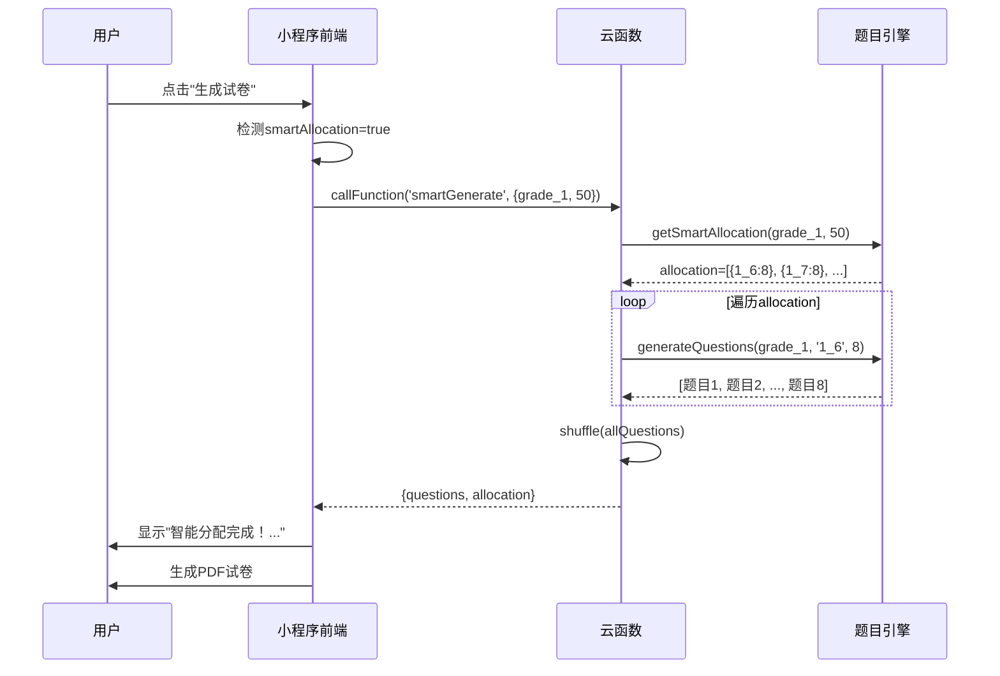

# 口算题目引擎智能化升级文档

## 📋 概述

本次升级将口算题目生成引擎从简单的年级合并配置（1-2、3-4、5-6年级）重构为**精细化的1-6年级独立配置**，并实现了**智能分配算法**，确保出题科学合理、符合教学大纲。

---

## 🎯 核心特性

### 1. 精细化题型拆解

按照小学数学教学大纲，将口算题型拆解为**82种细分题型**：

| 年级 | 题型数量 | 核心内容 |
|------|---------|---------|
| 一年级 | 10种 | 100以内加减法基础（10以内、20以内、整十数、凑十法等） |
| 二年级 | 9种 | 100以内加减法提高、表内乘除法、简单混合运算 |
| 三年级 | 8种 | 三位数加减法、两位数乘除法、带括号混合运算、单位换算 |
| 四年级 | 7种 | 大数四则运算、运算律速算、小数加减法、含括号混合 |
| 五年级 | 7种 | 小数乘除法、分数加减法（同/异分母）、解简单方程 |
| 六年级 | 7种 | 分数四则运算、百分数应用、比值化简、倒数口算 |

### 2. 智能权重分配算法

每种题型都配置了**科学权重**（weight），系统根据权重自动计算题目分配比例：

```javascript
// 一年级示例权重配置
'1_6': { name: '20以内进位加法', weight: 3 },  // 重点题型
'1_1': { name: '10以内加法', weight: 2 },      // 基础题型
'1_3': { name: '凑十法加法', weight: 1 }        // 辅助题型
```

**分配算法逻辑**：
- 计算总权重：`totalWeight = Σ(weight)`
- 按比例分配：`count_i = round((weight_i / totalWeight) × totalCount)`
- 保证最小值：每个题型至少1题
- 随机打乱：生成后打乱题目顺序

---

## 🔧 技术架构

### 云函数端 (cloudfunctions/gradeEngine/)

#### 1. gradeConfig.js - 题型配置中心

```javascript
const GRADE_CONFIG = {
  'grade_1': {
    name: '一年级',
    level: 1,
    categories: [
      {
        id: '1_1',
        name: '10以内加法',
        description: '如: 3 + 5',
        rules: { minValue: 0, maxValue: 10, operators: ['+'], allowCarry: false },
        difficulty: 'easy',
        weight: 2  // 权重系数
      },
      // ... 其他9种题型
    ],
    practiceRange: {
      questionCount: [10, 20, 30],
      timeLimit: 300,
      targetAccuracy: 80
    }
  },
  // ... grade_2 到 grade_6
};
```

**新增核心函数**：
- `getSmartAllocation(gradeKey, count)` - 智能分配算法
  - 输入：年级、题目总数
  - 输出：`[{categoryId, categoryName, count, weight}]`

#### 2. questionEngine.js - 题目生成引擎

**专用生成器**（针对1-3年级所有题型）：
```javascript
generate_1_1(rules)  // 10以内加法
generate_1_2(rules)  // 10以内减法
generate_1_3(rules)  // 凑十法加法（填空题）
generate_1_6(rules)  // 20以内进位加法（确保进位）
generate_2_5(rules)  // 表内乘法
generate_2_7(rules)  // 乘加/乘减混合
generate_3_6(rules)  // 带括号混合运算
generate_3_8(rules)  // 单位换算
// ... 共26个专用生成器
```

**智能生成逻辑**：
```javascript
function generateByRules(categoryId, rules) {
  const generatorMap = {
    '1_1': generate_1_1,
    '1_2': generate_1_2,
    // ... 映射表
  };
  
  const generator = generatorMap[categoryId];
  return generator ? generator(rules) : generateSimpleQuestion(rules);
}
```

#### 3. index.js - 云函数入口

**新增 action: 'smartGenerate'**

```javascript
case 'smartGenerate':
  const { gradeKey, count } = data;
  
  // 1. 获取智能分配方案
  const allocation = getSmartAllocation(gradeKey, count);
  // 输出: [{categoryId:'1_6', categoryName:'20以内进位加法', count:15, weight:3}, ...]
  
  // 2. 为每个题型生成相应数量的题目
  const allQuestions = [];
  for (const item of allocation) {
    const questions = generateQuestions(gradeKey, item.categoryId, item.count);
    allQuestions.push(...questions);
  }
  
  // 3. 打乱题目顺序（Fisher-Yates洗牌算法）
  shuffle(allQuestions);
  
  return { success: true, data: { questions, allocation } };
```

### 小程序前端 (miniprogram/pages/pdfGenerator/)

#### index.js 修改要点

**1. 智能分配模式判断**
```javascript
async generateQuestions() {
  if (smartAllocation) {
    return this.generateQuestionsWithSmartAllocation();  // 调用新函数
  }
  // 否则使用原有逻辑
}
```

**2. 智能分配云函数调用**
```javascript
generateQuestionsWithSmartAllocation() {
  return new Promise((resolve) => {
    wx.cloud.callFunction({
      name: 'gradeEngine',
      data: {
        action: 'smartGenerate',  // 新的action
        gradeKey: selectedGrade,  // 直接使用 grade_1 ~ grade_6
        count: questionCount
      },
      success: (res) => {
        const { questions, allocation } = res.result.data;
        
        // 显示分配详情
        const info = allocation.map(item => 
          `${item.categoryName}:${item.count}题`
        ).join(', ');
        Message.info({ content: `智能分配完成！${info}` });
        
        resolve(questions);
      }
    });
  });
}
```

**3. 移除旧的年级转换函数**
- 删除 `convertToCloudFormat()` 方法
- 直接使用 `grade_1` ~ `grade_6` 格式

---

## 📚 题型详细规则示例

### 一年级重点题型

#### 1.6 - 20以内进位加法
```javascript
rules: {
  minValue: 0,
  maxValue: 20,
  operators: ['+'],
  allowCarry: true,
  requireCarry: true  // 强制进位
}

生成逻辑:
- num1: 5~9（个位较大）
- num2: 5~9（个位较大）
- 校验: (num1 % 10) + (num2 % 10) >= 10
- 示例: 8 + 7 = 15, 9 + 6 = 15
```

#### 1.7 - 20以内退位减法
```javascript
rules: {
  minValue: 10,
  maxValue: 20,
  operators: ['-'],
  requireBorrow: true  // 强制退位
}

生成逻辑:
- num1: 10~20
- num2: 5~9
- 校验: (num1 % 10) < (num2 % 10)
- 示例: 15 - 9 = 6, 13 - 7 = 6
```

### 二年级重点题型

#### 2.5 - 表内乘法
```javascript
rules: {
  minValue: 1,
  maxValue: 9,
  operators: ['×']
}

示例: 6 × 9 = 54, 7 × 8 = 56
```

#### 2.7 - 乘加/乘减混合
```javascript
rules: {
  operators: ['×', '+', '-'],
  steps: 2,
  pattern: 'multiply_first'
}

示例: 3 × 5 + 4 = 19, 4 × 6 - 5 = 19
运算顺序: 先乘后加/减
```

### 三年级重点题型

#### 3.6 - 带括号简单混合
```javascript
rules: {
  minValue: 1,
  maxValue: 50,
  operators: ['+', '-', '×', '÷'],
  steps: 2,
  allowParentheses: true
}

示例: (50 - 20) ÷ 5 = 6
生成策略: 括号内用加减，括号外用乘除
```

---

## 🎲 智能分配示例

### 场景1: 一年级，生成50题

**输入**:
```javascript
gradeKey: 'grade_1'
count: 50
```

**权重配置**:
```
1_1: 10以内加法 (weight=2)
1_2: 10以内减法 (weight=2)
1_3: 凑十法 (weight=1)
1_4: 20以内不进位加法 (weight=2)
1_5: 20以内不退位减法 (weight=2)
1_6: 20以内进位加法 (weight=3) ← 重点
1_7: 20以内退位减法 (weight=3) ← 重点
1_8: 整十数加 (weight=1)
1_9: 整十数减 (weight=1)
1_10: 混合运算 (weight=2)
总权重: 19
```

**分配结果**:
```javascript
[
  { categoryId: '1_6', categoryName: '20以内进位加法', count: 8, weight: 3 },
  { categoryId: '1_7', categoryName: '20以内退位减法', count: 8, weight: 3 },
  { categoryId: '1_1', categoryName: '10以内加法', count: 5, weight: 2 },
  { categoryId: '1_2', categoryName: '10以内减法', count: 5, weight: 2 },
  { categoryId: '1_4', categoryName: '20以内不进位加法', count: 5, weight: 2 },
  { categoryId: '1_5', categoryName: '20以内不退位减法', count: 5, weight: 2 },
  { categoryId: '1_10', categoryName: '混合运算', count: 5, weight: 2 },
  { categoryId: '1_3', categoryName: '凑十法', count: 3, weight: 1 },
  { categoryId: '1_8', categoryName: '整十数加', count: 3, weight: 1 },
  { categoryId: '1_9', categoryName: '整十数减', count: 3, weight: 1 }
]
总计: 50题
```

**生成的题目示例** (已打乱顺序):
```
1. 8 + 7 = ?      (1_6: 20以内进位)
2. 30 + 40 = ?    (1_8: 整十数加)
3. 15 - 9 = ?     (1_7: 20以内退位)
4. 5 + 3 = ?      (1_1: 10以内加法)
5. 12 + 6 = ?     (1_4: 20以内不进位)
6. 7 + □ = 10     (1_3: 凑十法)
7. 9 + 8 = ?      (1_6: 20以内进位)
8. 5 + 3 - 2 = ?  (1_10: 混合运算)
...
50. 18 - 5 = ?    (1_5: 20以内不退位)
```

---

## 🚀 使用方法

### 用户操作流程

1. **打开PDF生成页面**
2. **选择年级**：一年级 ~ 六年级
3. **启用智能分配**：点击"智能分配"开关
   - 系统自动根据年级匹配题型
   - 题型选择按钮自动禁用（灰色显示）
4. **设置题目数量**：20/30/50/80/100题
5. **点击生成试卷**
6. **查看分配详情**：顶部显示 "20以内进位加法:8题, 10以内加法:5题..."

### 技术调用流程



---

## 📊 算法优势

### 1. 教学科学性
- ✅ 严格遵循小学数学教学大纲
- ✅ 题型难度梯度合理（easy → medium → hard）
- ✅ 重点题型（高weight）占比更大

### 2. 题目多样性
- ✅ 82种细分题型，覆盖所有口算场景
- ✅ 自动避免重复题目（使用Set去重）
- ✅ 随机打乱顺序，每次生成不重复

### 3. 技术可靠性
- ✅ 云函数+本地双重降级方案
- ✅ 专用生成器确保规则精确
- ✅ 详细日志记录便于调试

### 4. 扩展性
- ✅ 新增题型只需添加配置+生成器
- ✅ 调整权重即可优化分配策略
- ✅ 支持未来扩展到更高年级

---

## 🔍 测试建议

### 1. 功能测试
```javascript
// 测试一年级智能分配50题
wx.cloud.callFunction({
  name: 'gradeEngine',
  data: {
    action: 'smartGenerate',
    gradeKey: 'grade_1',
    count: 50
  }
}).then(res => {
  console.log('分配方案:', res.result.data.allocation);
  console.log('题目总数:', res.result.data.questions.length);
  
  // 验证点:
  // 1. 题目总数 = 50
  // 2. allocation数组包含10个题型
  // 3. 各题型count之和 = 50
  // 4. 重点题型(weight=3)的count最多
});
```

### 2. 边界测试
- 最小题目数: `count: 10` (每个题型至少1题)
- 最大题目数: `count: 100`
- 年级边界: `grade_1` ~ `grade_6`

### 3. 性能测试
- 云函数响应时间 < 3秒（100题）
- 题目去重成功率 > 95%

---

## 📝 版本信息

- **版本**: v2.0
- **发布日期**: 2025-12-01
- **开发者**: AI Assistant
- **云函数**: gradeEngine (已部署)
- **兼容性**: 微信小程序基础库 ≥ 2.0

---

## 🔗 相关文档

- [项目指南](PROJECT_GUIDE.md)
- [云函数开发指南](CLOUD_FUNCTION_GUIDE.md)
- [题目生成引擎快速开始](GRADE_ENGINE_QUICK_START.md)
- [Git快速参考](GIT_QUICK_REFERENCE.md)

---

## 📞 技术支持

如遇问题，请检查：
1. 云函数是否已部署最新版本
2. 小程序是否有云开发权限
3. `gradeConfig.js` 配置是否完整（所有6个年级）
4. 前端是否移除了旧的 `convertToCloudFormat` 方法

---

**🎉 恭喜！口算题目引擎已升级为智能化科学出题系统！**
